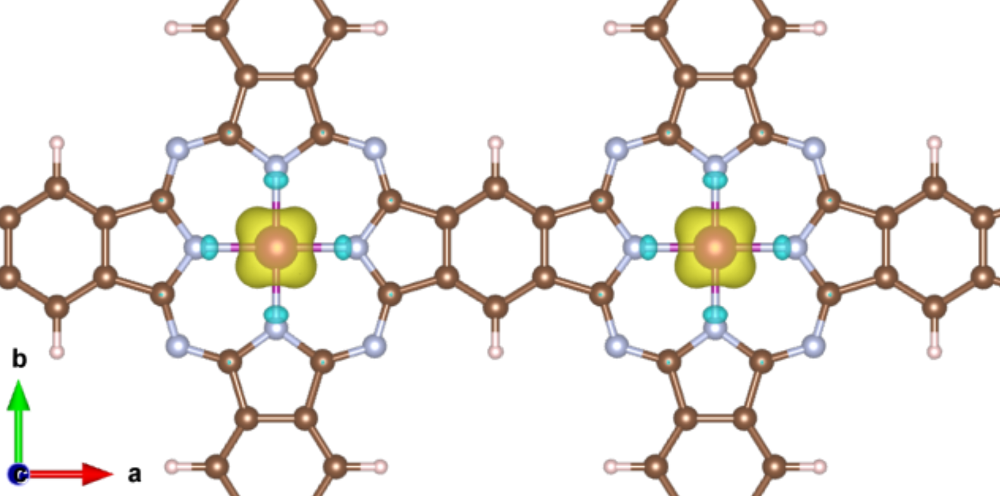
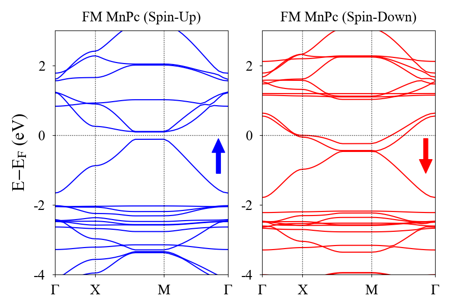
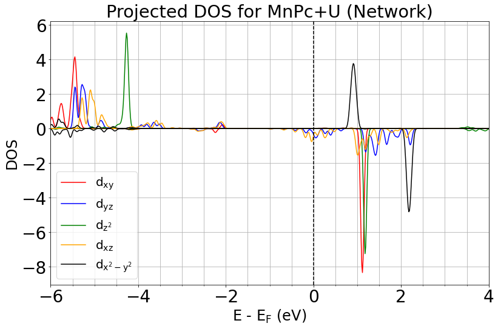
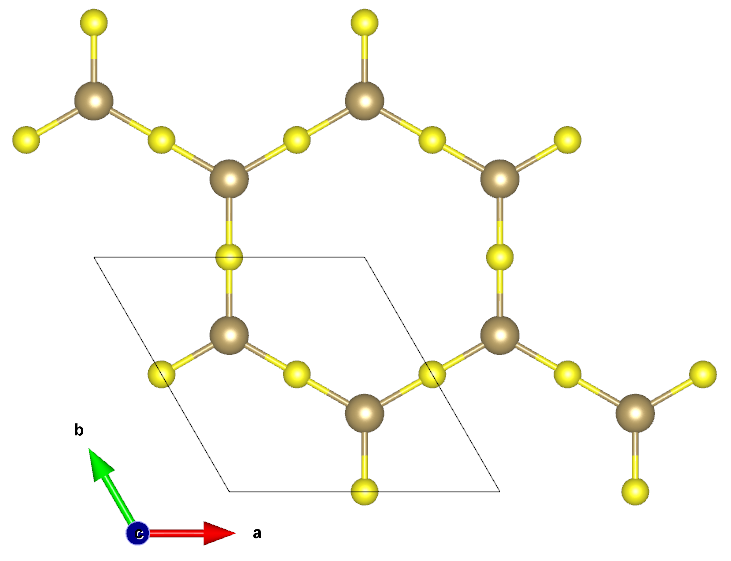
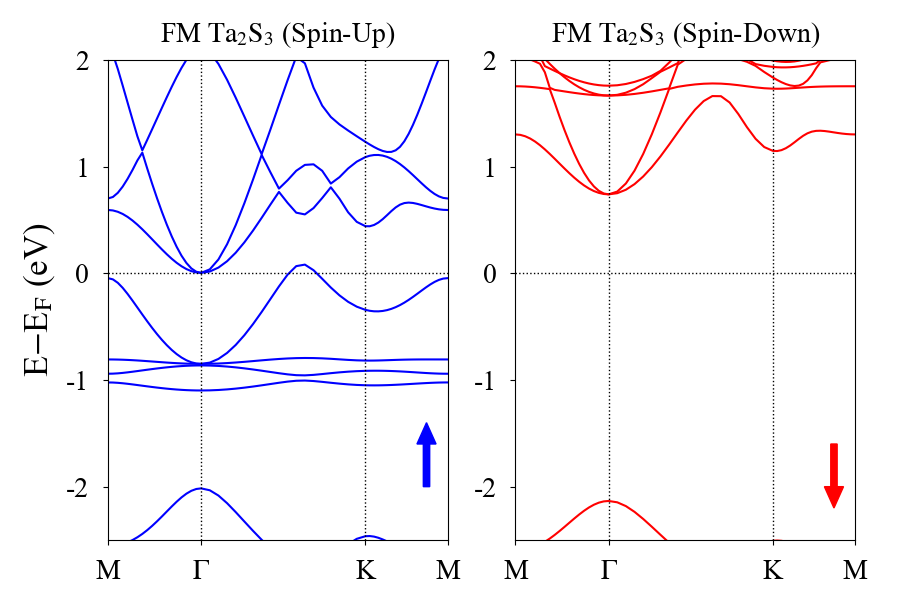
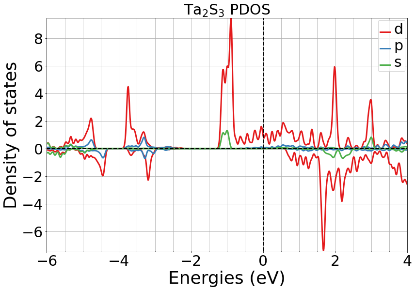
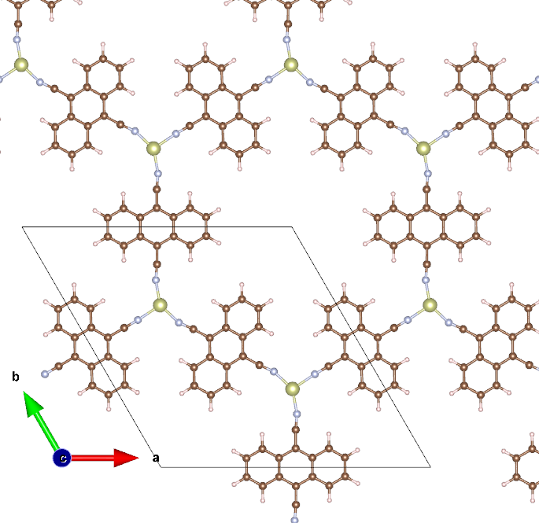
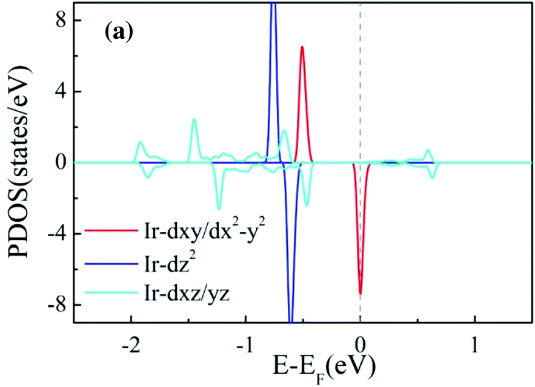
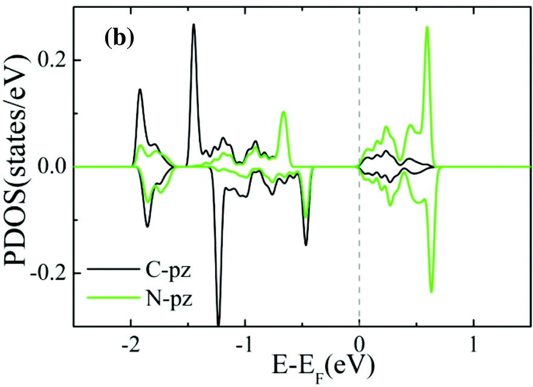

# VASP Input Files for Metal-Organic Framework M.Sc.
---
This project investigated magnetism in self-assembling metal-organic frameworks. To achieve this, we performed Density Functional Theory (DFT) calculations using the Vienna _ab-initio_ Simulation package ([VASP](https://www.vasp.at/)). All calculations used standard PBE_PAW potentials, accessible from VASP. These are **not** included in this repository.

---

## Manganese Octoamine-Phthalocyanine (MnPc)

MnPc was investigated due to the experimental synthesis of Fe-Phthalocyanine [[1](https://pubs-acs-org.ucd.idm.oclc.org/doi/10.1021/ja108628r)]. A spin-polarised DFT calculation using the generalised gradient approximation (GGA) and conjugate-gradient algorithm was used to minimise this system. This simulation employed the projector-augmented-wave (PAW) potential, using the Perdew-Burke-Ernzerhof (PBE) exchange correlation functional. Since the standard GGA exchange function cannot properly describe strongly correlated systems with partially filled _d_ subshells, the simulation used the _GGA+U_ extension. By dividing the delocalised s and p electrons, and the localised d electrons into two separate groups, qualitative improvement for ground state properties such as exchange interaction was found. The chosen values for the Hubbard _U_ and Hund _J_ were 4 eV and 1 eV respectively. The Brillouin zone was sampled with a Gamma-centred, Monkhurst-Pack **k**-point grid of 9x9x1 with a z-axis separation of 15 A to minimise interaction between layers. The energy cut-off, convergence criteria and force was set to 400eV, 1e-5 eV and 0.01 eV/A. Using Fe as our transition metal, the lattice parameter was calculated to be 10.70 \AA which shows good agreement with Matthieu Abel _et. al._. Using Mn, we attained a lattice parameter of 10.69 A.

To investigate the magnetic coupling, we used a 2x2 super-cell with a Monkhurst-Pack **k**-points grid of 5x5x1$. The spin moments were defined for the ferromagnetic (FM) and anti-ferromagnetic (AFM) symmetries were defined. Due to the magnetic moment arising from the d-orbitals, spin-orbit coupling parameters were defined. Using a non-self consistent calculation, the magnetic moment vector was varied from in-plane to out-of-plane ([100] -- [001]), to calculate the magnetic axis anisotropy energy.

The Hubbard _U_ parameter and the Hund _J_ parameter were required to properly describe the half-filled _d_-orbitals. This induced Jahn-Teller distortions through half-filling the d_{xz} and d_{yz} orbitals. Substantial spin-polarisation occurred, resulting in a half-metal DOS. A magnetic moment of 3 uB was found.

---

---

---

## Tantalum Trisulfide

The Ta2S3 unit cell was created and periodic boundary conditions were implemented. We enforced a z-axis separation of 15 A to minimise inter-layer interactions. Using the PAW potentials and PBE functionals, a _GGA+U_ approach was taken to describe the strongly correlated 4d electrons in Ta. The simplified, rotationally invariant approach by Dudarev _et. al._ was used and we chose 3.0 eV as our _U-J_ parameter. Atomic positions and lattice parameters were fully relaxed using a sequential combination of quasi-Newton - Raphson integration of Newtonian mechanics (RMM-DIIS) and the conjugate-gradient algorithm. The Brillouin zone was sampled with an 11X11x1 Gamma-centred Monhurst-Pack grid. The energy cut-off, convergence criteria and force were set to 500eV, 1e-5 eV and 0.01 eV/A. Finally, the screened hybrid density functional by Heyd–Scuseria–Ernzerhof (HSE06) was used to check the electronic structure.

To investigate the magnetic exchange energies, the FM and AFM state were calculated using a self-consistent approach. Using a non-self consistent calculation, the magnetic moment was swept across [100] -- [001] to calculate the magnetic axis anisotropy energy.

Strong trigonal planar hybridisation was observed. Structure exhibited an insulator-like spin-down channel

---

---

---

## Iridium Dicyanoanthracene

We employed a 2D hexagonal unit cell with lattice parameter of 20.80 A and theta = 120* and enforced a z-axis distance of 15 A. Using PAW potentials and PBE functionals, a GGA approach was taken to minimise the system. The plane wave energy cut-off, convergence criteria and force was set to 550eV, 1e-5 eV and 0.01 eV/A respectively. The Brillouin zone was sampled with a 5x5x1 Gamma-centred Monkhurst-Pack grid. The lattice parameter and atomic positions were allowed to change.

The energies of the FM and AFM states were calculated using a self-consistent simulation, employing the spins from the unit cell. The magnetic axis anisotropy energy was calculated by sweeping the magnetic moment across [100] -- [001] with a non-self consistent approach.

---

---

---